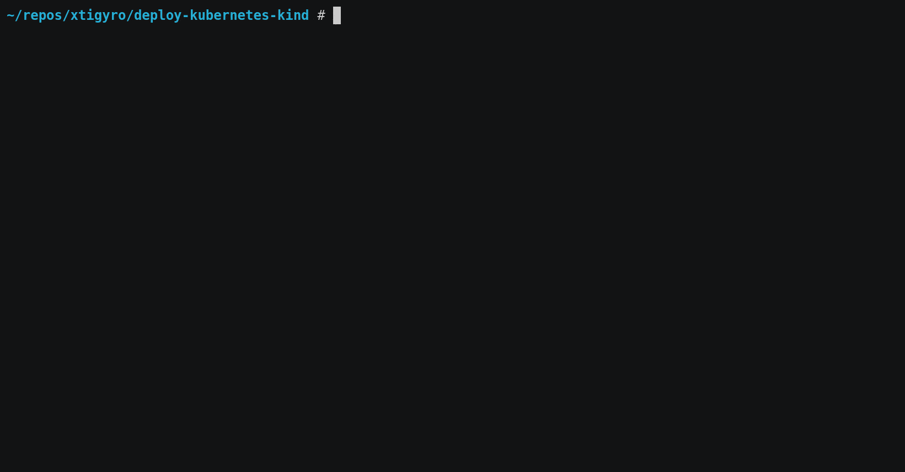

# deploy-kubernetes-kind

Create a local one or multi-node K8s cluster preset for development with one command.

## Demo



## Quick Start

To create a local K8s cluster in Docker container(s) with properly configured Helm (optionally `tillerless`), Ingress Controller, MetalLB, and Metrics Server - please run:

```bash
cd local-cluster
bash prerequisites-cmds.sh --helm_ver=2.[x].[x]             # Helm ver. is optional.
bash create-cluster.sh --nodes=[1-99] --k8s_ver=1.[x].[x]   # Only no. of K8s nodes is mandatory.
```

## Prerequisite Notes

The `prerequisites-cmds.sh` can be used either like a true Shell script, or the commands which are part of it can be executed one by one. It depends on your preference.

`prerequisites-cmds.sh` downloads and installs the following software:

1. Linux Docker container runtime (`docker.io` or `docker-ce` pkg depending on your OS).
2. `kubectl` binary.
3. `helm` binary.
4. Helm plugins: `helm-diff` and `tiller`.
5. `helmfile` binary.
6. `kind` binary.

## Credits

My name is [Miroslav Hadzhiev](https://www.linkedin.com/in/mehadzhiev/) - a DevOps Engineer located in Sofia, Bulgaria. I'm glad that you liked my automation.

## Licence

GNU General Public License v2.0
